<div align="center">

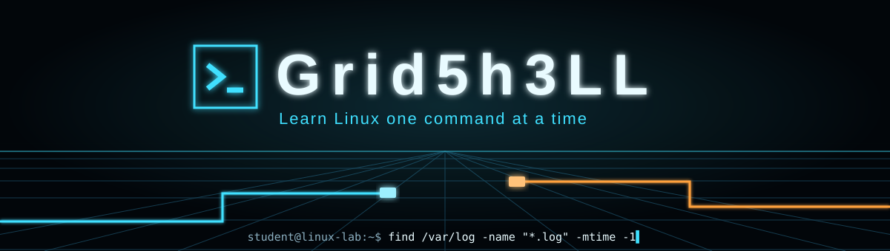

<br>

**A Linux training system that runs in one HTML file.
It teaches, tests, and adapts to you — then turns practice into a light-cycle arcade game.**

<br>


[Meet Nux](#-meet-nux) · [Built with Claude](#-built-with-claude) · [Quick start](#-quick-start) · [Features](#-features) · [Terminal lab](#-terminal-lab) · [Derezz](#-derezz) · [Scenario lab](#-scenario-lab) · [Mastery](#-how-mastery-works) · [Privacy](#-privacy-and-browser-support)

<br>

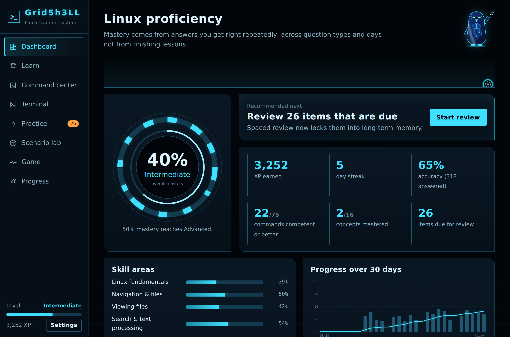

</div>

<br>

## 🐧 Meet Nux


Nux is the Linux penguin's grid-born cousin. He was compiled on the grid, so his feathers are deep navy with a sheen, his eyes are a cyan visor, and circuit lines run across his chest.

Nux changes his outfit for every part of this page, just as you change tools for every part of Linux.

<br clear="right">

## 🤖 Built with Claude

Grid5h3LL was designed and built in conversation with **Claude**, Anthropic's AI assistant. The goal: **take a learner from zero to confident on the Linux command line**, and always answer three questions — *What do I know? What don't I know? What should I practice next?*

Every feature started as a plain-language request. Claude turned each one into working code:

| The request | What Claude built |
| :-- | :-- |
| *"A professional training platform, not a webpage of tutorials"* | 8 connected sections that share one learning engine |
| *"Progression based on demonstrated understanding"* | Four mastery stages per command, earned across question styles and days |
| *"A safe terminal to practice in"* | A simulated Bash shell with its own files, users, processes and services |
| *"Adapt to me, and use spaced repetition"* | Question selection that targets weak and due items, with review intervals that grow as you improve |
| *"Realistic Linux situations"* | 8 incident scenarios: full disks, runaway processes, broken services, and more |
| *"A game that makes me retrieve and apply commands"* | **Derezz**, a light-cycle arcade game played by typing commands |
| *"The visual language of TRON"* | A dark grid interface with cyan glow, plus a light theme and large-text option |

The result is one self-contained file with no frameworks, build steps, accounts, or servers.

<br>

## 🚀 Quick start


```text
1. Download grid5h3ll.html
2. Double-click it to open it in any modern browser
3. Follow "Recommended next" on the dashboard
4. Start with the lesson "What Linux is"
5. Come back tomorrow — your reviews will be waiting
```

> [!TIP]
> A strong daily routine takes 10–15 minutes: clear your due reviews, do one practice round, then play a wave of Derezz.

<br clear="right">

## ✨ Features


<table>
<tr>
<td width="50%" valign="top">

### 📘 Learn
16 lessons across 12 skill areas, from the kernel and the filesystem tree to permissions, networking, systemd, and shell scripting. Each lesson ends with a check that counts toward mastery. Distribution differences (apt, dnf, pacman) are called out, and your own distro is highlighted.

</td>
<td width="50%" valign="top">

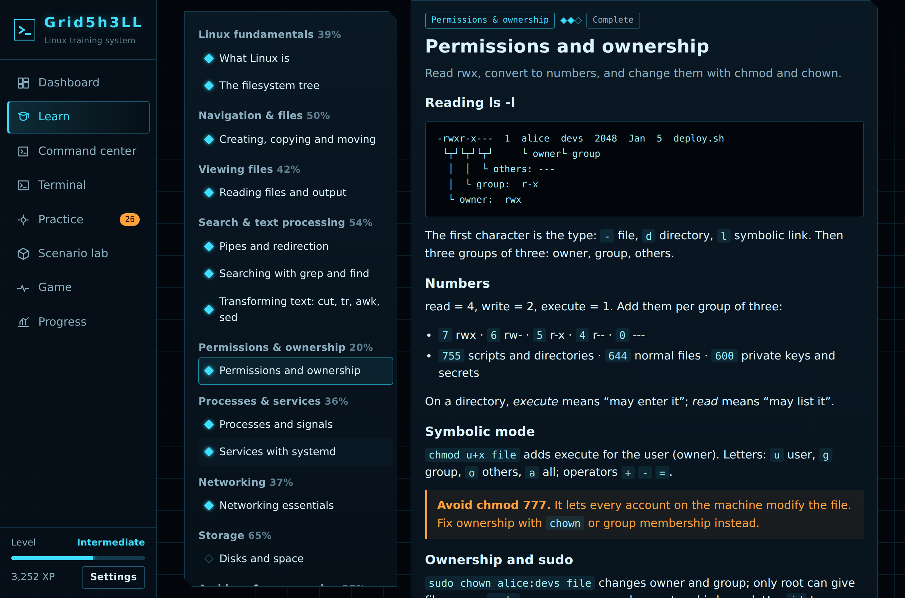

</td>
</tr>
<tr>
<td width="50%" valign="top">

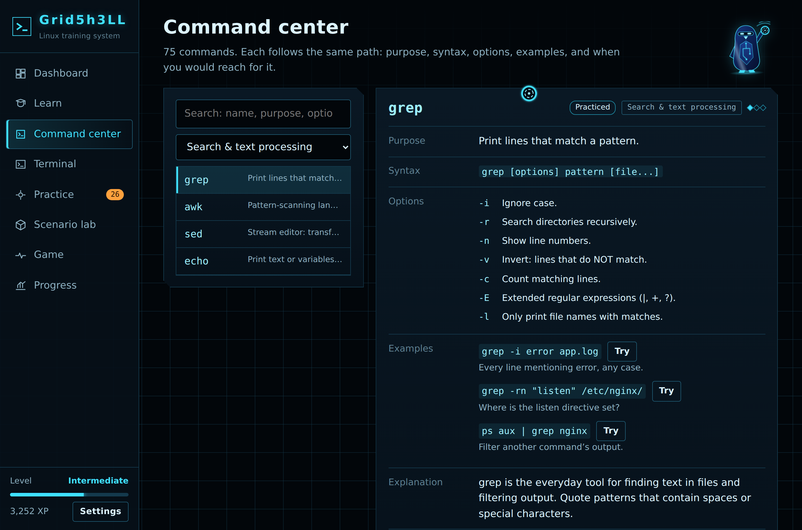

</td>
<td width="50%" valign="top">

### 🧭 Command center
75 commands, each laid out the same way: **purpose → syntax → options → examples → explanation → practical scenario**. Destructive commands carry a warning. Try any example in the terminal, practice a single command, or mark it for review.

</td>
</tr>
<tr>
<td width="50%" valign="top">

### 🎯 Practice
Ten-question rounds chosen from your own data. Question styles include multiple choice, fill in the command, predict the output, fix the command, sequence the steps, match command to purpose, and troubleshooting. After every answer you see why each option is right or wrong, the concept behind it, and what to remember.

</td>
<td width="50%" valign="top">

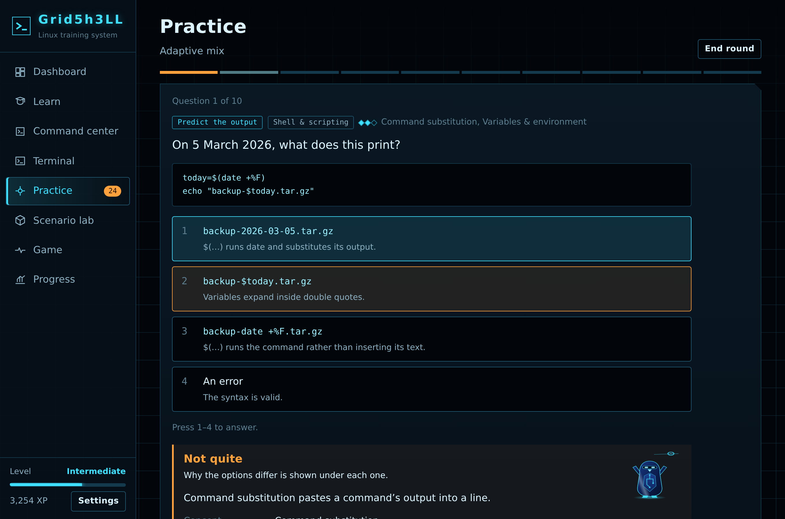

</td>
</tr>
<tr>
<td width="50%" valign="top">

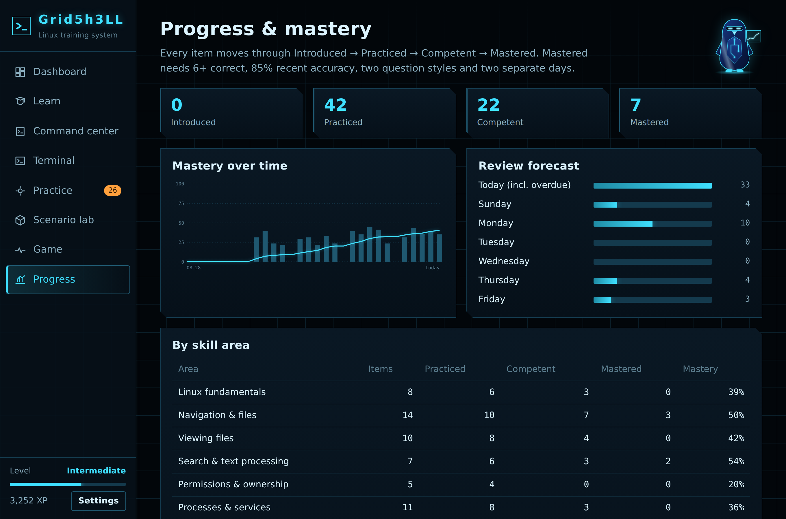

</td>
<td width="50%" valign="top">

### 📈 Progress
Mastery by skill area and by command, accuracy by question style and difficulty, time spent, scenario and game results, a 7-day review forecast, and a full review history.

</td>
</tr>
</table>

<br clear="right">

## 💻 Terminal lab

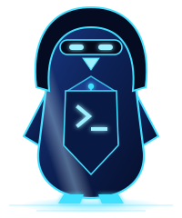

A simulated Bash shell running a pretend Ubuntu 24.04 machine. **Nothing you type runs on your computer.**

It supports pipes, redirection (`>` `>>` `2>` `<`), `&&` `||` `;`, variables, `$(...)`, and `*` globs. It enforces real file permissions, so `sudo` matters. It also has processes you can `kill` and systemd services you can `systemctl`. Tab completion and history work as you expect.

The first time you run `rm`, a warning explains that deleted files on a real system are gone for good.

12 challenges are checked automatically after every command, such as *"Count the errors"* and *"Top talker"*.

<br clear="right">

<div align="center">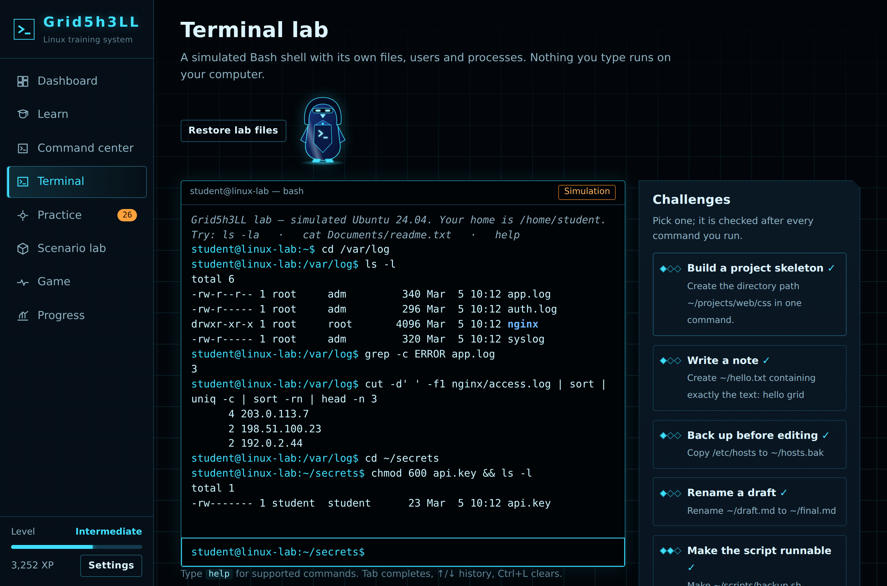</div>

<br>

## 🏍️ Derezz

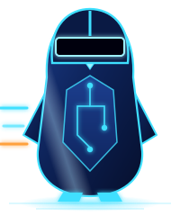

Rogue programs descend the grid, and each one carries a task, such as *"Start nginx now and at boot."* Type the command to derezz it before it reaches the core.

- **Retrieval, not recognition:** you type every answer from memory.
- **Instant correction:** a miss shows the right command on the spot.
- **Waves and combos:** later waves add harder tasks, and combos multiply your score up to ×4.
- **A daemon boss every 5th wave:** a multi-step incident such as the *Disk-eater daemon*.
- **It counts:** every answer updates your mastery, and a local high-score table keeps your best runs.

<br clear="right">

<details>
<summary><b>Controls</b></summary>

<br>

| Key | Action |
| :-- | :-- |
| <kbd>Enter</kbd> | Fire at the highlighted program (or start / resume) |
| <kbd>Tab</kbd> | Switch target |
| <kbd>Esc</kbd> | Pause |

An answer that fits a different program on screen hits that program instead.

</details>

<div align="center">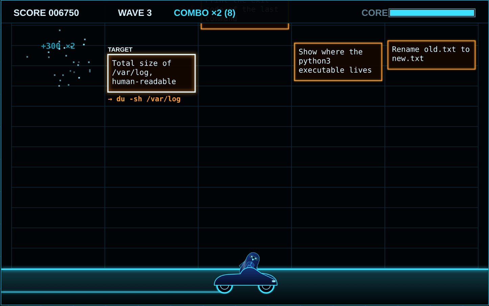</div>

<br>

## 🛰️ Scenario lab


Eight realistic incidents. You get an objective, not instructions:

*The disk is almost full · A process is eating the CPU · Access denied to a shared file · The web service will not start · Where is that config file? · Secure access to a new server · Websites will not load · Port 80 is already taken*

At each step you decide which command to run. Common wrong turns get specific feedback. For example, deleting a log that a program still has open does **not** free the space.

<br clear="right">

<div align="center">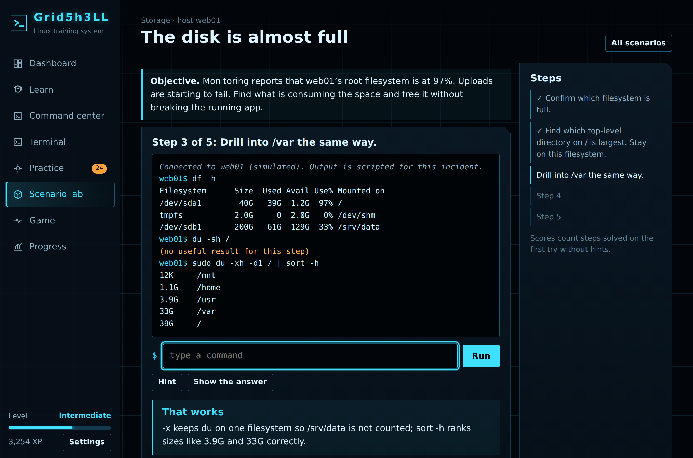</div>

<br>

## 🧠 How mastery works


Every command and concept moves through four stages. Finishing a lesson doesn't count as mastery. **Getting it right, repeatedly, in different ways, on different days** does.

```text
Introduced  →  Practiced  →  Competent            →  Mastered
seen it        tried it       3+ correct,            6+ correct, 85% recent accuracy,
                              70% recent accuracy    2+ question styles, 2+ separate days
```

**Spaced review:** a miss comes back in about 10 minutes. Correct answers push the next review out to 1 day, then 3, then longer.

**Adaptive selection:** practice leans toward weak, due, and flagged items. If you keep missing `chmod`, related permission questions show up more often.

**Levels:** Beginner, Novice, Intermediate, Advanced and Expert follow your overall mastery. Expert also requires solving 6 scenarios.

<br clear="right">

## 🔒 Privacy and browser support


Everything stays on your computer. There are no accounts, servers, or analytics. Progress is saved in your browser's local storage. Use **Settings → Export progress** to back it up as a JSON file, or **Import** to restore it on another machine.

| Browser | Status |
| :-- | :-- |
| Chrome / Edge | ✅ Full support |
| Firefox | ✅ Full support |
| Safari | ✅ Full support |
| Mobile browsers | ✅ Responsive layout with bottom navigation |

The only network request loads the display fonts from Google Fonts. Offline, the app uses system fonts and works the same.

<br clear="right">

## 🛠️ Tech

One HTML file with inline CSS and JavaScript. It uses Canvas 2D for the game, SVG for the charts and mastery disc, and localStorage for saving. The code is split into modules for data, the learning engine, storage, the terminal simulation, the UI, and the game. New commands, lessons, questions, and scenarios are plain data objects, so the content can grow to thousands of items.

<br>

<div align="center">

**Made by Z3Y, built with Claude, so every command becomes second nature.**

<sub>Nux is an original character created for Grid5h3LL.<br>Released under the MIT License. See <a href="LICENSE">LICENSE</a>.</sub>

</div>
